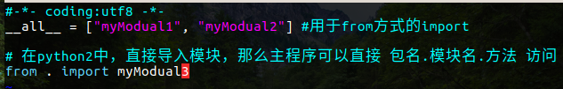

<!-- toc orderedList:0 depthFrom:1 depthTo:6 -->

* [注释](#注释)
    * [注释方式](#注释方式)
    * [注释编码声明](#注释编码声明)
* [intput()和print()](#intput和print)
    * [注意点：](#注意点)
* [变量](#变量)
    * [可变类型和不可变类型](#可变类型和不可变类型)
    * [id()和type()](#id()和type())
    * [数据拷贝copy](#数据拷贝copy)
    * [字符串](#字符串)
    * [列表](#列表)
    * [字典](#字典)
    * [元组](#元组)
    * [集合](#集合)
* [条件语句](#条件语句)
    * [if-else](#if-else)
    * [while](#while)
    * [for](#for)
* [运算符](#运算符)
    * [普通运算符](#普通运算符)
    * [逻辑运算符](#逻辑运算符)
    * [三目运算符](#三目运算符)
    * [进制转化](#进制转化)
* [函数](#函数)
    * [局部变量和全局变量](#局部变量和全局变量)
    * [LEGB规则](#LEGB规则)
    * [help()的使用](#help的使用)
* [文件](#文件)
* [类和对象](#类和对象)
    * [属性和方法](#属性和方法)
    * [动态增加类的方法](#动态增加类的方法)
    * [`__slots__`限制类实例能添加的属性](#__slots__限制类实例能添加的属性)
    * [私有化](#私有化)
    * [对象的引用计数](#对象的引用计数)
    * [对象创建的流程](#对象创建的流程)
        * [创建单例](#创建单例)
    * [property属性](#property属性)
* [元类](#元类)
    * [类也是对象](#类也是对象)
    * [动态创建类](#动态创建类)
    * [type就是个元类](#type就是个元类)
    * [`__metaclass__`](#__metaclass__)
* [继承](#继承)
* [多态](#多态)
* [异常](#异常)
* [模块](#模块)
    * [`__name__`](#__name__)
    * [`__all__`](#__all__)
* [包](#包)
    * [包的制作](#包的制作)
    * [包的发布和安装](#包的发布和安装)
* [程序传参](#程序传参)
* [列表生成表达式](#列表生成表达式)
* [生成器](#生成器)
* [迭代器](#迭代器)
* [闭包](#闭包)
* [装饰器](#装饰器)
* [垃圾回收机制](#垃圾回收机制)
* [数据库操作](#数据库操作)
* [网络通信](#网络通信)
* [爬虫](#爬虫)

<!-- tocstop -->

//[TOC]

# 注释
## 注释方式
```python
print("xcgj")
#行注释
'''
块注释
'''
"""
asd asd
"""

a="xcgj"
print(a)
```
## 注释编码声明
```python
#coding=utf-8
```
- 第一行加的声明是为了让 python版本2识别中文
- 也可以将其替换成python推荐的声明:  

```python    
#-*- coding:utf-8 -*-
```

# intput()和print()
```python
b = 123
c = 'asd'
print(a)                #纯变量输出
print("a的值是%d"%b)    #格式化输出整数
print("name=%s"%c)      #格式化输出字符串
print("name=%s, age=%d, addr=%s"%(c, b, a))
```

## 注意点：
- 在python2中，input接收的用户输入会被当成代码执行，不接受字符串
- 在python3中，input接收的用户输入会被当成字符串
- 在python2中，input可以使用raw_input指定为字符串接收,python3没有这个函数:  

```python
a = input("python2只接受数字/代码计算，python3接受任意输入：")
if type(a) == type(1):
    print("刚刚输入的结果是：%d"%a)
elif type(a) == type('a'):
    print("刚刚输入的结果是：%s"%a)

#b = raw_input("可以接收任意输入：")
b = 'python3不支持raw_input()函数'
print(b)

# print()打印不换行的方法
print("*", end="")
# print()打印换行
print("")
```  

# 变量
- 数字（int long float complex）  
- 布尔  
- String：python的字符串一般不考虑\0，因此"ABC"占用的是3个字节的内存
- List
- Tuple（元组）
- Dictionary（字典）

## 可变类型和不可变类型
可变类型：列表、字典  
不可变类型：数字、字符串、元组，用来作为字典的键值  
内存存储字典数据时，会将键进行hash得到一串数字，然后将值存储到这串数字对应的内存地址中；因此要求字典的键是不可改变的，不然取数据时键发生过改变，会导致取出的值错误

## id()和type()
id(a)查询变量a引用的地址
type(a)确定类型
```python
# python3的input默认将输入变成字符串，int强转
c = int(input("请输入一个数字："))
type(c)
d = str(c) #将整形转成字符串
```

## 数据拷贝copy
```python
#-*- coding:utf-8 -*-
import copy

# deepcopy 深拷贝
a = [1,2,3]
b = a
c = copy.deepcopy(a)
print("id(a)=%s, id(b)=%s,id(c)=%s"%(id(a),id(b),id(c)))

# deepcopy 可变数据类型
d = [a,c]
e = copy.deepcopy(d)
a.append(-1)
print("eepcopy 可变数据类型：id(d)=%s, id(e)=%s"%(id(d),id(e)))
print(d[0],e[0])

# deepcopy 不可变数据类型
d = (a,c)
e = copy.deepcopy(d)
a.append(-1)
print("deepcopy 不可变数据类型d：id(d)=%s, id(e)=%s"%(id(d),id(e)))
print(d[0],e[0])

# copy 可变数据类型，实际进行了深拷贝
d = [a, c]
e = copy.copy(d)
a.append(4)
print("copy 可变数据类型：id(d)=%s, id(e)=%s"%(id(d),id(e)))
print(d[0],e[0])

# copy 不可变数据类型，实际进行了浅拷贝
d = (a, c)
e = copy.copy(d)
c.append(0)
print("copy 不可变数据类型：id(d)=%s, id(e)=%s"%(id(d),id(e)))
print(d[0],e[0])

"""
id(a)=60198792, id(b)=60198792,id(c)=65399112
eepcopy 可变数据类型：id(d)=60893000, id(e)=60891528
([1, 2, 3, -1], [1, 2, 3])
deepcopy 不可变数据类型d：id(d)=60116552, id(e)=65356104
([1, 2, 3, -1, -1], [1, 2, 3, -1])
copy 可变数据类型：id(d)=60891528, id(e)=65396552
([1, 2, 3, -1, -1, 4], [1, 2, 3, -1, -1, 4])
copy 不可变数据类型：id(d)=65356104, id(e)=65356104
([1, 2, 3, -1, -1, 4], [1, 2, 3, -1, -1, 4])
"""
# 总结
# copy模块的deepcopy总是对数据进行深拷贝
# copy模块的copy会根据当前拷贝的数据类型有不同的处理方式，可变类型是深拷贝，不可变类型是浅拷贝
```

## 字符串

```python
mystr = "abcdefgh abcdefgh"
```

- 当一个变量是一个字符串时，在交互模式下，按".+tab"键查看所有字符串函数

- 字符串的负数下标，逆序取字符  

```python
a = "abcdefg"
print(a[-1]) # 'g'
print(a[-2]) # 'f'
```

- 字符串拼接  

```python
a = '123'
b = 'abc'
print(a + b) # '123abc'
print("===%s==="%(a+b)) # '===123abc==='
```

- 字符串切片   
[开始:结束),左闭右开,格式：[起始位置:终止位置:步长]  

```python
a = 'message'
a[2:6] # 'ssag'
a[2:-1] # 'ssag'

# 取到最后一个字符(步长取不到值为止)
a[2:] #ssage
# 错误写法
a[2:0] # ""

# 跳跃切片--步长，默认步长是1
a[1:-1:1] # 'essag'
a[1:-1:2] # 'esg'

# 利用步长逆序
a[-1::-1]  # 'egassem'
a[::-1] # 'egassem' 步长自动识别起始位置
```

- find()函数和rfind()  
能找到就返回匹配字符串首个字符的下标，找不到就返回-1  

```python
mystr.find("bcd") # 1 从左边开始匹配
mystr.rfind("bcd") # 10 从右边开始匹配
```

- index()函数和rindex()  
找不到就程序崩溃  

- count()  
检查指定字符串出现的次数

- replace()  
替换，参数三表示替换的次数  

```python
mystr.replace("abc", "kkkk", 1) # "kkkkdefg abcdefg"
```

- split()  
切割，按指定字符切割，切割结果列表展示  
如果括号内不填参数，默认切割全部空白字符

- capitalize()  
字符串第一个字母大写

- title()  
每个单词首字母大写

- startwith()和endwith()  

```python
mystr.startwith("abc") # True
mystr.endwith("abc") # False
```

- lower()和upper()  
转换字符串中所有字符的大小写

- ljust()和rjust()和center()   
括号内参数填宽度(int)  
左对齐、右对齐和居中，不够以空格填充

- lstrip()和rstrip()和strip()   
删除左、右、两边空格

- partition()和rpartition()   
以括号内字符串切割母串，返回元组  
只匹配一次  

```python
mystr.partition(' ')
# 返回元组
# ('abcdefg', ' ', 'abcdefg')
```

- splitlines()   
按换行符分割为列表

- isalpha()和isdigit()和isalnum()   
判断字符串是不是 纯字母 纯数字 字母数子混合

- join()   
将列表中的数据以一定的格式组成字符串  

```python
b = ['aaa', 'bbb', 'ccc']
c = '=='
d = c.join(b) # 'aaa==bbb==ccc'
"".join(b) # aaabbbccc
```


## 列表
可以同时存储多种不同类型的数据  

```python
a = [1,'acv', 3.14,567,0,1]
b = ['a','b','c']
```
增：  
- a.append(123)  整体添加成为1个元素
添加数据到列表结尾  
- a.insert(0, "aaa")  
指定位置添加数据    
- 列表相加
1. 直接使用 + 号：a+b  
2. a.extend(b)  扩展len(b)个元素到a里面
3. 分片赋值：a[len(a):] = b    

删    
- a.pop()  
删除最后一个元素并打印这个元素  
- a.remove(1)
删除从左往右找到的第一个元素  
- del.a[0]
删除列表的第0个元素

改
- a[1] = 'a'
下标索引修改

查
- in  

```python
if 111 in a:
  print("a列表有元素111")
else:
  print("a列表没有元素111")
```
- not in  


函数和方法  
- len(a)
求列表元素的个数


## 字典  

```python
a = {"name":"aaa", "b": 1}

b = {}
b["name"] = "bbb"
b["age"] = 10

c = [a]

c.append(b)

for tmp in c:
  # print(tmp)
  print(tmp['name'])
```
- 增  

```python
a["c"] = "ccc";
```
- 删  

```ptthon
del a["b"]
```
- 改  

```python
a["name"] = "aa"
```
- 查

```python
# 字典没有键值直接崩
a["ddd"]
# 字典没有键值不输出
a.get("ddd")
```  

- 函数和方法
1. len(a)
求a字典中键值对的对数
2. a.get("name")
检查a中有没有"name"这个键
3. a.keys()
python2返回一个列表，列表元素是a中所有键值对的键  
python3返回一个对象，对象中含有a中所有键值对的键
4. a.values()
python2返回一个列表，列表元素是a中所有键值对的值  
python3返回一个对象，对象中含有a中所有键值对的值
5. a.items()
python2返回一个列表，列表有len(a)个元素，每个元素都是由一对键和值组成的元组  
python3返回一个对象，对象中含有一个列表，列表有len(a)个元素，每个元素都是由一对键和值组成的元组  
items()的用法：  

```python
#python2交互模式
>>> a={}
>>> a["name"] = 10
>>> a["age"] = "A"
>>> a
{'age': 'A', 'name': 10}
>>> a.items()
[('age', 'A'), ('name', 10)]
>>> b,c = a.items()
>>> b
('age', 'A')
>>> c
('name', 10)
>>> print("name=%s, age=%d"%c)
name=name, age=10
>>> for x, y in a.items():
...     print("key=%s, val=%s"%(x,y))
...
key=age, val=A
key=name, val=10
```
6. a.sort()  

```python
a.sort()              # 默认从小到大排序
a.sort(reverse=True)  # 从大到小排序
a.sort(key=len)       # 按元素的长度排序

lst=[{"name":"aa","age":30},{"name":"zz","age":20},{"name":"cc","age":80}]
lst.sort(key=lambda x:x["name"],reverse=True)
'''
适用于字典列表排序
key等于一个匿名函数，是一个lambda表达式，返回值（被比较的部分）是冒号后面的部分
: ：return
x：表示列表的每个元素，是一个字典
x["name"]：提取字典的name键，按他们的值比较排序
x["age"]：提取字典的age键，按他们的值比较排序
reverse=True：从大到小排序
'''
```


## 元组

```python
#创建单个元素的元组
>>> a=1,
>>> a
(1,)
>>>
```

## 集合
集合内没有相同的数据，用来去重
```python
>>> c = {1,2,3,4,5,2,3,4,5,6}
>>> c
{1, 2, 3, 4, 5, 6}

>>> a = [1,2,3,4,5,6,7,2,3,4]
>>> b = set(a)
>>> b
{1, 2, 3, 4, 5, 6, 7}
>>> a = list(b)
>>> a
[1, 2, 3, 4, 5, 6, 7]
```

# 条件语句
## if-else
python 没有switch  

```python
if 条件:
  print(a)
  print(c)
elif 条件:
  pass
else :
  print(e)
print(f)
```
pass的作用是告诉编译器这里有代码，以后会补全，先别报错  

注意点：
- 不要忘了冒号
- 注意缩进

```python
# if的真假判断
>>> if True:
	     print("true")

true
>>> if False:
	     print("true")

>>> if "":
	     print("true")

>>> if None:
	     print("true")

>>> if 0:
	     print("true")

>>> if ():
	     print("true")

>>> if []:
	     print("true")

>>> if {}:
	     print("true")
```

## while
python 没有do while  

```python3
while 条件:
  print(a)
  print(b)
print(c)
```
注意点：
- 不要忘了冒号
- 注意缩进  

## for
```python
str = "ABCD"
#依此打印出字符串中的每个字符,\0除外
for temp in str
  print(temp)
```
python语法for循环和else联用
```python
lst = [1,2,3]
# lst = []
for tmp in List:
  print(tmp)
  #break
else:
  print("test")
# 不管lst表是不是空，else语句都会被打印
# 如果for语句中有break，那么else语句不会打印
```

# 运算符
## 普通运算符
```python
a = 5
b = 2

c = a//b #取商

c = a**b #a的b次方--幂

c = "AB" * a # 重复字符串
print(c) # ABABABABAB

a <> b # 不等于，建议使用 !=
```
## 逻辑运算符
```python
# python 中的and从左到右计算表达式，若所有值均为真，则返回最后一个值，若存在假，返回第一个假值。
# or也是从左到有计算表达式，返回第一个为真的值。
>>> "a" and 'b'
'b'
>>> "" and 'b'
''
>>> "" and 'b' or "c"
'c'
```
## 三目运算符
```python
## 铺垫1
>>> d = []
>>> d
[]
>>> d = [1]
>>> d[0]
1
## 铺垫2
>>> a = 100
>>> b = 200
>>> a<b and a or b
100
>>> a>b and a or b
200
# 出问题
>>> a = 0
>>> a<b and a or b
200     # 遇到0，解析器认为是False，结果选择了or运算，输出错误
# 解决方法--使用列表输出
>>> (a<b and [a] or [b])[0]
0
>>> (a>b and [a] or [b])[0]
200
```
## 进制转化

```python
#coding=utf-8
a = 100
b = 0100    #八进制
c = "0x100"   #十六进制
d = 0b100   #二进制
print(bin(a), oct(a), hex(a))
print(int(b), int(c, 16), int(d))# 如果第一个参数是字符串，int()第二个参数表示的是第一个参数是哪种进制类型
"""
('0b1100100', '0144', '0x64')
(64, 256, 4)
"""
```

# 函数
- 普通函数的封装  

```python
# 函数返回值
def foo(i,j=0,k=0): # 有缺省（默认）参数
  a=1
  b=2
  c=3
  return a,b,c # 返回的是元组
  # return [a,b,c] # 返回的是列表

a = foo(5,k=5)  # a是一个元组 (1,2,3)
                # 有命名参数，指定函数形参k的值是5
a,b,c = foo(1,1,1) # a=1, b=2, c=3
```
```python
# 命名参数指定形参的值
def fo(a, b, c=10, d=0, e=1):
  pass

fo(b=3, a=2, e=8, c=5)  
```
```python
# 函数的不定长参数1
def f1(a, b, *args):
  print(a)
  print(b)
  print(args)
  result = a + b
  for tmp in args:
    result += tmp
  return result

f(1,2)          # args是空元组，args=()
f(1,2,3,4,5,6)  # args=(3,4,5,6)
```
```python
# 函数的不定长参数2

#-*- coding:utf-8 -*-
def f2(a, b, c=0, *args, **kwargs):
    print(a)
    print(b)
    print(args)   # 元组
    print(kwargs) # 字典

f2(1,2,3,4,5,6,7,x=99,y=100)
```
```shell
# f2运行结果：
xcgj@xcgj:~$ python test.py  
1
2
(4, 5, 6, 7)
{'y': 100, 'x': 99}
```
```python
# 函数的不定长参数3--拆包

#-*- coding:utf-8 -*-
def f3(a, b, c=0, *args, **kwargs):
    print(a)
    print(b)
    print(args)   # 元组
    print(kwargs) # 字典

m=(4,5,6,7)
n={"abc":99, "def":100} # 疑问：当键指定为整型（如10，11）或浮点型（如1.1，1.2）报错：TypeError: f3() keywords must be strings，为何？？？
f3(1,2,m,n)
print("="*10)
f3(1,2,*m,**n)
```
```shell
# f3运行结果：
xcgj@xcgj:~$ python3 test.py
1
2
({'def': 100, 'abc': 99},)
{}
==========
1
2
(5, 6, 7)
{'def': 100, 'abc': 99}
```

总结：  
>1. 函数可以有多个返回值，可以返回元组、列表、字典
>2. 命名参数可以不按照函数形参的顺序传递实参，命名参数的名字必须是形参名字的其中一个
>3. 实参多于形参时，形参用 *变量名 接收没有名字(如a)的实参，组成元组；用 **变量名 接收有名字(如a=3)的实参，组成字典
>4. 实参传元组变量或字典变量给形参时，若需要拆分，需要在实参元组变量前加 * ，在字典变量前加 **  

- 主函数的封装  

```python
'test.py文件'
def foo():
    a = 10
    print(a)

def main():
    foo()

main()
```

```shell
# 运行：
xcgj@xcgj:~$ python test.py
10
```
- 匿名函数  

```python
# 相当于回调函数
def test(a,b,func):
  return func(a,b)

num = test(1,2,lambda x,y:x+y)
print(num)

'''
test函数中的func函数是一个回调函数，他在test函数体内引用了实参传过来的匿名函数(lambda表达式)
lambda表达式的冒号是return的意思，返回了x+y的结果
'''
```
```python
# 函数自定义
def test(a,b,func):
  return func(a,b)

# python2的input接收的是一个表达式，程序不出错
fun1=input("请输入一个函数(python2)：") # lambda x,y:x*y
num = test(1,2,fun1)
print(num)

#python3的input接收的是一个字符串，需要用eval去掉字符串的引号变成表达式
fun2=input("请输入一个函数(python3)：") # lambda x,y:x/y
fun2=eval(fun2)
num = test(1,2,fun2)
print(num)
```


## 局部变量和全局变量
全局变量放在函数被调用之前，命名规范：g_变量名  

```python
a = 100
def f1():
  global a # 声明要使用全局变量a，而不是自己定义一个局部变量a，一般放在函数作用域开始的位置
  a = 10
  return a

print(f1()) # 10
print(a)  # 10
```
如果列表、字典等序列定义成了全局变量，  
若函数需要用到这个序列，不需要在函数内声明global，直接使用就行，  
但加上global会增加代码的可读性  

```python
# 可变类型和不可变类型对函数的影响
a = 100
lst = [200]
def test(num1, num2):
  num1 += num1
  num2 += num2
  print(num1) # 200
  print(num2) # [200, 200]

test(a, lst)  
print(a)    # 100
print(lst)  # [200, 200]
'''
如果函数变量所指向的全局变量是可变类型的，会直接对全局变量本体进行修改
如果函数变量所指向的全局变量是不可变类型，函数会自己定义一个同名变量，将结果放入自定义的变量里面
'''
```
```python
# num+=num并不等价于num=num+num
lst1 = [100]
lst2 = [200]
def test(num1, num2):
  num1 += num1        # num1直接引用了[100]，对本体进行了操作
  num2 = num2 + num2  # 等号右边的两个num2引用了本体[200]，把值取出来相加(两个列表拼接)，
                      # 结果会放在内存的其他地方，然后函数自定义了同名变量去引用了这个结果
  print(num1) # [100, 100]
  print(num2) # [200, 200]

test(lst1, lst2)  
print(lst1)  # [100, 100] # num+=num影响了本体
print(lst2)  # [200]      # num=num+num不会影响本体
'''   
如果函数变量所指向的全局变量是可变类型的，会直接对全局变量本体进行修改
如果函数变量所指向的全局变量是不可变类型，函数会自己定义一个同名变量，将结果放入自定义的变量里面
'''
```

## LEGB规则
变量查找顺序：局部-闭包-全局-内建
locals -> enclosing function -> globals -> builtins
`dir(__builtin__)`查看内建变量


## help()的使用
退出help界面使用 q
- 可以用来查看变量说明及系统函数说明

```python
a = [1,2]
help(a) # 会进入list类的说明
```

- 查看自定义函数说明   
前提是函数第一行已经用一对单引号或一对双引号或三对单引号或三对双引号注释过  

```python
def foo():
  '''函数说明'''
  pass
  return

help(foo)
```


# 文件
- 打开关闭文件
```python
f = open("test.py", "r") # 读的方式打开文件，默认打开方式
'''
"w"：写文件
'''
f.close()
```
- 读文件
```python
f.read()  # 读取文件全部内容
f.read(n) # 读取文件n个字符
f.readline()  # 读取一行，遇到\n停止读取
f.readlines() # 读取全部行，以列表展示。每一行是列表的一个元素
```
- 写文件
```python
f.write("aaaaaaa")  # python3返回值是写入的字符数
```
- 文件定位
```python
f.tell  # 显示当前文件游标的位置
f.seek(-10,2) # 将文件游标定位到文件的倒数第10个字节处
'''
参数1：偏移量，python3不支持负数
参数2：
0 ：文件开始位置
1 ：文件游标当前位置
2 ：文件结尾
'''
```
- 文件的其他操作
```python
# 需要先导入模块
import os
os.rename("a.py", "b.py") # 把a.py重命名为b.py
os.remove("b.py")         # 把b.py删除
os.mkdir("py")            # 创建py文件夹
os.rmdir("py")            # 删除py文件夹
os.getcwd()               # 返回当前操作的绝对路径
os.chdir("../")           # 改变当前默认路径，将创建的文件放入改变后的路径
os.listdir("../")         # 以列表的形式返回指定路径下的文件和文件夹
```
- 文件批量重命名
```python
# 改变默认路径修改
import os
# 获取当前目录某个文件夹下的所有文件名
dirname = input("重命名文件所属的文件夹是：")
files = os.listdir(dirname)
# 改变当前操作路径到那个文件夹，进行文件操作
os.chdir(dirname)
# 重命名文件
for cur_name in files:
  os.rename(cur_name, "xcgj-"+cur_name)
```
```python
# 在当前路径直接修改
import os
# 获取当前目录某个文件夹下的所有文件名
dirname = input("重命名文件所属的文件夹是：")
files = os.listdir(dirname)
# 重命名文件
for cur_name in files:
  oldname = dirname+"/"+cur_name
  # newname = dirname+"/"+cur_name[5:]
  pos = cur_name.find("-")
  newname = dirname+"/"+cur_name[pos+1:]
  os.rename(oldname, newname)
```


# 类和对象
## 属性和方法
```python
# 定义类  
class Clazz:
  # __init__ 方法--初始化对象的函数
  # __str__ 方法--打印信息函数
  def __init__(self, name, age):
    print("init方法，初始化对象的函数")
    self.name = name #往对象里面添加了2个实例属性
    self.age = age

  def __str__(self):
    return "print 对象名会自动调用这个函数%s"%self.name
    #自动使用了init方法创建的局部变量

  def fun1(self): #self就是C++中的this指针
    print("普通函数")

  def printinfo(self):  # 第一个参数一定要写，可以不叫self
    print("%s的年龄是：%d"%(self.name, self.age)) #自动获取变量


# 创建对象，并返回一个对象的引用给obj
obj = Clazz("aaa", 20)  #自动调用__init__
print(obj)  #自动调用__str__
obj.fun1()        # 方法调用
#obj.name = "abc"  # 给obj这个对象添加了实例属性 name
#obj.age = 30
```
类在程序中也是一个对象，占内存空间，称为类对象，其中的属性叫做类属性  
类创建对象时，每个对象里面都会有一个特殊的属性，这个属性保存了这个类的引用，被创建的这个对象称为实例对象，其中的属性叫做实例属性  
类属性在实例对象中共享  

|类属性|实例属性|
|---|---|
|在类被定义时类中的属性和方法|对象自己添加的变量|
|类名.变量|self.变量|

同理，可以得到类方法、实例方法和静态方法
|类方法|实例方法|静态方法|
|---|---|---|
|@classmethod|/|@staticmethod|
|至少一个形参|至少一个形参|至少0个形参|
|类名.方法名 对象名.方法名|对象名.方法名|类名.方法名 对象名.方法名|
```python
#类属性和类方法的访问
class Clazz(object):
  num = 0 #类属性
  def __init__(self, Name): #实例方法
    self.name = Name        #实例属性
    Clazz.num += 1
    print("创建了%d个实例对象"%Clazz.num)

  #类方法
  @classmethod  #声明调用的是类方法
  def add_num(cls): #cls名字可以修改，cls指向类对象
    cls.num = 100   #类方法里直接修改类属性

  #静态方法--可以没有任何参数
  @staticmethod
  def printInf():
    print("静态方法")


a = Clazz(11)
b = Clazz("22")
c = Clazz("33")

Clazz.add_num() #通过类的名字调用类方法
a.add_num()     #通过类创建的对象调用类方法

Clazz.printInf() #通过类的名字调用静态方法
a.printInf() #通过类创建的对象调用静态方法
```

## 动态增加类的方法
- MethodType方法动态添加
```python
>>> class Test(object):
	def Method(self):
		print("---Method---")
		return 1


>>> def NewMethod(self):    # 注意需要有一个参数用来传递类对象
	print("---NewMethod---")
	return 2


>>> import types
>>> test = Test()
>>> test.method2 = types.MethodType(NewMethod, test)
>>> test.Method()
---Method---
1
>>> test.method2()
---NewMethod---
2
>>> fun = types.MethodType(NewMethod, test)
>>> fun()
---NewMethod---
2
```
- MethodType方法多参数传参
```python
>>> def NewMethod(self, param):
	print("---NewMethod-%s--"%param)
	return 2

>>> test.method3 = types.MethodType(NewMethod, test)
>>> test.method3("111")
---NewMethod-111--
2
```

- 静态方法和类方法
```python
import types

class Clazz:
  def __init__(self, name):
    self.name = name

def talk(self):
  print("%slisten"%self.name)

@staticmethod     #静态方法
def look():
  print("look")

@classmethod      #类方法
def eat(cls):
  print("eateat")


>>> obj = Clazz("obj")
>>> obj.talk = types.MethodType(talk, obj) # 对象和函数绑定，添加方法
>>> obj.talk()
objlisten
>>> ccc = types.MethodType(talk, obj)     # 函数引用
>>> ccc()
objlisten
>>> Clazz.lo = look
>>> Clazz.lo()
look
>>> Clazz.e = eat
>>> Clazz.e()
eateat
```
```python
class A:
    a = 2
    b = 5
    c = 9
    __d = 11

    def __init__(self):
        print self.a
    def norma(self):
        print self.b
    @classmethod
    def clsmd(cls):
        print cls.c
    @staticmethod
    def sttmd():
        print "static"

x = A()
x.norma()
x.clsmd()
x.sttmd()
```

## `__slots__`限制类实例能添加的属性
限制类实例能添加的属性
```python
class Clazz(object):
  __slots__ = ("name", "age") # 只能创建name和age两个属性

>>> a = Clazz()
>>> a.name = "aa"
>>> a.age = 10
>>> a.a = 11
Traceback (most recent call last):
  File "<pyshell#39>", line 1, in <module>
    a.a = 11
AttributeError: 'Clazz' object has no attribute 'a'
```
>注意：`__slots__`定义的属性只对当前类实例起作用，对继承的子类无效

## 私有化
|命名格式|使用规则|
|---|---|
|`xx`|公有变量|
|`_xx`|私有属性或方法，用`from somemodule import *`的方式不会导入这些属性或方法，用`import somemodule`的方式可以用对象访问这些属性或方法。可以用类对象和子类访问这些属性或方法|
|`__xx`|避免与子类中的属性命名冲突，无法在外部直接访问，因为有名字重整|
|`__xx__`|用户名字控件的魔法对象或属性，不可自定义这样的名字|
|`xx_`|用于避免与python关键词的冲突|

名字重整：防止子类意外重写基类的方法或属性，私有属性不能直接访问，是因为被改名字了，可以通过` _类名__属性名 `访问。访问`__xx`，如 `_Class__xx`
- 注意：私有属性仅被` from somemodule import * `限制，如果` import somemodule `,可以 `somemodule.私有属性` 访问


```python
#私有属性，出现在类的函数中 self.变量名
class Class:
  def setAge(self, Age):
    self.age = Age

  def getAge(self):
    return self.age

a = Class()
a.setAge(30)
a.getAge()
```
```python
# 私有方法，函数名前加2个下划线 __函数名
class Class:
  def __privatefun(self):
    self.age += 10;

  def setAge(self, Age):
    self.age = Age
    self.__privatefun()

  def getAge(self):
    return self.age

a = Class()
a.setAge(30)
a.getAge()
```
## 对象的引用计数
```python
#计算对象的引用计数
import sys
sys.getrefcount(a) #a是对象名
'''
测量结果会比实际引用计数大1，原因：
sys调用getrefcount()方法时，方法形参获取了实参a的引用
多出来的一个引用数量其实是属于形参的
'''
```
```python
# __del__ 删除的方法--析构函数
class Class:
  def __del__(self):
    print("对象被删除")

a = Class() #a引用的对象的引用计数为1
b = a       #a引用的对象的引用计数为2
c = Class() #c引用的对象的引用计数为1

del a       #a引用的对象的引用计数为1
del b       #a引用的对象的引用计数为0，b对象自动调用__del__(self)
print("程序结束")
#c引用的对象的引用计数为0，c对象自动调用__del__(self)
```

## 对象创建的流程
在python中，对象的创造和初始化是在2个函数中进行的
- `__new__`(cls)方法用来创建一个类的对象，用一个 匿名变量 来接收`__new__`(cls)的返回值，这个返回值是新创建的对象的引用
- `__init__`(self)，匿名对象传入形参self，self引用了`__new__`(cls)的返回值，对新的对象进行初始化操作
- `__init__`(self)返回对象的引用给变量
```python
class Clazz(object):
  def __init__(self): #只负责对象的初始化
    print("初始化")
  def __str__(self):
    print("对象的描述信息")
  def __del__(self):
    print("对象的引用被删除")
  def __new__(cls):   #只负责对象的创建
    print("重写了父类的new方法")
    return object.__new__(cls)
    # 如果重写了Clazz的__new__方法却没有调用一下父类的__new__方法，那么就不会创建新的对象，__init__方法也不会被调用
    # 不要忘了参数，把自己传给父类创建对象

obj=Clazz();
```

### 创建单例
```python
# 单例
# 利用类属性和__new__(cls)方法实现单例
class Clazz(object):
  __instance = None #定义一个私有类属性，用来验证单例，也用来保存单例对象地址
  def __new__(cls):  #重写new函数
    if cls.__instance == None:
      cls.__instance = object.__new__(cls)  #保存新对象的引用
      return cls.__instance
    else:
      return cls.__instance

a=Clazz()
b=Clazz()
print(id(a))
print(id(b))
```
```python
# 单例
# new和init的参数数量需要保持一致
class Clazz(object):
  __instance = None
  def __new__(cls,name):  #注意参数,虽然name用不到
    if cls.__instance == None:
      cls.__instance = object.__new__(cls)  
      return cls.__instance
    else:
      return cls.__instance
  def __init__(self,name):
    self.name = name

a=Clazz("A")
print(id(a),a.name)
b=Clazz("B")
print(id(a),a.name) #a.name变成了B--单例的引用特性
print(id(b),b.name)
```

## property属性
设置property属性可以设置set方法和get方法
- 方法一
```python
class Money(object):
  def __init__(self):
    self.__money = 0
  def getMoney(self):
    return self.__money
  def setMoney(self, value):
    if isinstance(value, int):
      self.__money = value
    else:
      print("error:不是整型数字")

  money = property(getMoney, setMoney)

test = Money()
test.money = 100
print(test.money)
```
- 方法二
```python
class Money(object):
  def __init__(self):
    self.__money = 0

  @property     #get方法
  def money(self):
    return self.__money

  @money.setter #set方法
  def money(self, value):
    if isinstance(value, int):
      self.__money = value
    else:
      print("error:不是整型数字")

test = Money()
test.money = 200
print(test.money)
```

# 元类
## 类也是对象
类拥有创建实例对象的能力，但类的本质也是对象，可以被赋值拷贝、增加属性、作为函数参数传递
```python
>>> def fun(param):
	   print(param)

>>> class Clazz():
	   pass

>>> Clazz
<class '__main__.Clazz'>
>>> fun(Clazz)              #类作为函数参数
<class '__main__.Clazz'>
>>> Clazz.attr = "增加属性"  #增加类属性
>>> hasattr(Clazz, 'attr')
True
>>> Clazz.attr
'增加属性'
>>> clazz = Clazz           #类被拷贝
>>> clazz
<class '__main__.Clazz'>
>>> clazz.attr
'增加属性'
>>>
>>> id(Clazz)
2851755114600
>>> id(clazz)
2851755114600
```
## 动态创建类
- 在函数中创建类
```python
>>> def ClazzCreater():
    	class newClass():
    		def __str__(self):
    			return "在函数中创建的类"
    	return newClass    # 返回的是类

>>> Clazz = ClazzCreater() # 获得newClass类的引用
>>> Clazz
<class '__main__.ClazzCreater.<locals>.newClass'>
>>> instance = Clazz()     # 用这个类创建一个实例
>>> instance
<__main__.ClazzCreater.<locals>.newClass object at 0x00000297FA132320>
>>> print(instance)
在函数中创建的类
```
- 使用type创建类
```python
>>> type("字符串")
<class 'str'>
>>> type(Clazz)     # 类的类型是type
<class 'type'>
>>> type(instance)  # 实例的类型是这个newClass类
<class '__main__.ClazzCreater.<locals>.newClass'>
```
type(类名,由⽗类名称组成的元组(针对继承的情况,可以为空),包含属性的字典(名称和值))
```python
>>> Clazz = type("Class",(),{})     # 类名Class，无继承，无属性，Clazz这个变量是Class这个类的引用，注意区分
>>> Clazz
<class '__main__.Class'>
>>> clazz = Clazz()
>>> clazz
<__main__.Class object at 0x00000297FA1ADD30>
```
添加属性
```python
>>> Clazz = type("Class", (), {"name":"xcgj"})
>>> Clazz.name
'xcgj'
>>> clazz = Clazz()
>>> clazz.name
'xcgj'
>>> ChildClazz1 = type("ChildClass1", (Clazz,), {"age": 10})
>>> ChildClazz1.age
10
>>> ChildClazz2 = type("ChildClass2", (Class,), {"age": 20})
Traceback (most recent call last):
  File "<pyshell#60>", line 1, in <module>
    ChildClazz2 = type("ChildClass2", (Class,), {"age": 20})
NameError: name 'Class' is not defined
```
> 注意：
只能用已有的类的引用来继承创建子类
父类的名字不是字符串
添加的属性是类属性，并不是实例属性

 添加方法
 ```python
 >>> def instanceFunc(self):
     	print("实例方法")
     	return self.attr

 >>> @classmethod
     def classFunc(cls):
     	print("类方法")
     	return cls.attr

 >>> @staticmethod
     def staticFunc():
     	print("静态方法")

>>> Clazz = type("Clazz",(),{"attr":100, "instanceFunc":instanceFunc, "classFunc":classFunc, "staticFunc":staticFunc})
>>> clazz = Clazz()
>>> clazz.classFunc()
类方法
100
>>> clazz.attr = 200        # 添加实例属性做参照
>>> clazz.instanceFunc()
实例方法
200
>>> clazz.classFunc()
类方法
100
>>> clazz.staticFunc()
静态方法
 ```
## type就是个元类
实例对象是由类产生的，而类就是由元类产生的。`type('ClassName', (), {})`可以产生一个类，所以type就是个元类
Python中所有的东⻄都是对象，这包括整数、 字符串、 函数以及类，它们都是从type创建⽽来，可以通过检查`__class__`属性来看到这⼀点
```python
>>> name = "xcgj"           # 字符串
>>> name.__class__
<class 'str'>
>>> name.__class__.__class__
<class 'type'>
>>> integer = 1             # 整数
>>> integer.__class__
<class 'int'>
>>> integer.__class__.__class__
<class 'type'>
>>> def foo(): pass         # 函数
>>> foo.__class__
<class 'function'>
>>> foo.__class__.__class__
<class 'type'>
>>> class Clazz(object): pass   # 类
>>> Clazz.__class__
<class 'type'>
>>> Clazz.__class__.__class__
<class 'type'>
```

## `__metaclass__`

#  继承
子类的类名后面加上小括号，括号里带上父类的类名
在python3中，如果一个类没有写任何继承，那么会默认继承底层基类object
class A:  #经典类
class A(object): #新式类
```python
# 方法的继承和重写
class Yeye:
  def fun1(self):
    print("1")

class Fulei(Yeye):
  def fun2(self):
    print("2")

class Sunzilei(Fulei):
  def fun3(self):
    print("3")
  def fun2(self):
    print("4") # 重写
    Fulei.fun2(self) #调父类fun2，传参self
    super().fun2() #用super也能调用被重写的父类的方法

obj = Sunzilei()
obj.fun1()
```
父类的私有属性和私有方法不会被子类继承（子类不可直接访问），但子类可以调用父类的公有方法访问父类的私有属性和私有方法

多继承存在相同方法的调用
```python
>>> class Base(object):
      def test(self):
		     print("Base")

>>> class A(Base):
	    def test(self):
		      print("A")

>>> class B(Base):
	     def test(self):
		       print("B")

>>> class C(B,A):
	     pass

>>> C.__mro__   #类名.__mro__ 查看函数调用顺序
(<class '__main__.C'>, <class '__main__.B'>, <class '__main__.A'>, <class '__main__.Base'>, <class 'object'>)

>>> a=C()
>>> a.test()
B

>>> class C(A,B):
	     pass

>>> C.__mro__
(<class '__main__.C'>, <class '__main__.A'>, <class '__main__.B'>, <class '__main__.Base'>, <class 'object'>)

>>> b=C()
>>> b.test()
A
```

# 多态
```python
>>> class A(object):
	     def duotai(self):
		       print("A")


>>> class B(object):
	     def duotai(self):
		       print("B")


>>> def printObject(obj):
	     obj.duotai()


>>> a=A()
>>> b=B()
>>> printObject(a)
A
>>> printObject(b)
B
```

# 异常
用来捕获异常，不把异常传递给系统，防止程序崩
```python
try:
  print(a)
  print("如果出现异常，此句不会被打印")
except NameError: #某一种异常的类别
# except Exception as result: #能捕获任意类型的异常
  print("捕获到异常，处理异常")

print("如果异常成功捕获，此句会被执行")
```
自定义一个异常，需要继承异常类
```python
class myExp(Exception):
  '''自定义异常类'''
  def __init__(self, code)
    self.num = code

def main():
  try:
    raise myExp(-1) #抛出自定义异常实例
  except myExp as res:  #异常类别是自定义异常类，res指向了抛出的异常实例的引用
    print("异常错误码：%d"%res.num)
  else:
    raise #向上层继续抛出这个异常

main()
```


# 模块
模块就是py文件，导入模块会同时把模块执行一遍  

linux下模块的存储路径：/usr/lib/python3.x.x   

飞机大战所需模块：  
sudo pip install pygame  
sudo pip3 install pygame  
pip：python模块管理工具  

模块导入后，第一次编译，会保存编译好的模块文件，称为字节码，后缀名是.pyc，节省下次编译的时间  

模块导入后，系统调用函数会先搜索当前路径，再搜索系统路径  

两种模块导入方式
```python
# 第一种
import myModul
myModul.test()  #函数使用需要带模块名

import myModul as MM  #改名
MM.test()
```
```python
# 第二种
from myModul import test1, test2
test1()    #函数直接使用

from myModul import *  #模块中的函数全部导入
#弊端：如果不同模块含有同名函数，后面导入的会覆盖前面的
```
- random  

```python
import random #导入模块
#限定a的值在[0, 1, 2]之间
a = random.randint(0, 2)
```

## `__name__`
`__name__`通常放在模块内，  
当模块自己用python解析器运行时，打印出来的字符串是`__main__`  
当模块被导入其他文件并运行时，打印出来的字符串是`__自己的模块名__`  
```python
# 模块文件
def test1():
  print("test1")

print(__name__)
test1()
```
```shell
xcgj@xcgj:~$ python3 mymodul.py
__main__
test1
```
```python
import mymodul
mymodul.test1()
```
```shell
xcgj@xcgj:~$ python3 py.py
mymodul #导入模块会同时把模块执行一遍  
test1   #导入模块会同时把模块执行一遍  
test1
```
因此通常用来打印调试信息
```python
# 模块文件
def test1():
  print("test1")

if __name__ == "__main__":
  test1()
```
```python
# 主程序文件
def main():
  pass

if __name__ == "__main__":
  main()
```

## `__all__`  
```
当别的文件以 from myModul import * 的方式导入模块时，模块限定了*的内容只能是__all__这个列表所包含的函数或变量
```
```python
#模块文件
__all__ = ["test1", "Clazz"]

def test1():
  print("test1")

num = 100

class Clazz:
  pass
```


# 包
## 包的制作
把文件夹（package）当成多个模块的集合的仓库
需要在该文件夹下创建一个`__init__.py`文件
当其他程序导入这个包时，会先自动执行一遍`__init__.py`文件
```python
'''__init__.py的配置'''
__all__ = ["myModul1", "myModul2"]
# 列表中放入当前文件夹下希望被其他程序导入的模块名

from . import myModul3 #导入程序可以使用模块中的方法
```
```python
import package
mymodul1.test1()    #模块调用
package.myModul3.test3()  #包名直接使用方法
```

在包内自定义的3个模块：


文件目录结构:


__init __.py文件的内容：


python2中init文件导入模块的使用效果：


from方式导入包：


```
在__init__.py文件中使用 import 模块名 仅支持python2
为了兼容python3，可以使用： from . import 模块名
```
兼容python3：



## 包的发布和安装
查看系统模块默认安装路径
```python
模块名.__file__
```
1. 模块的目录结构
```
xcgj@xcgj:~/python$ tree
.
└── package
    ├── __init__.py
    ├── myModual1.py
    ├── myModual2.py
    └── myModual3.py

1 directory, 4 files
```
2. 编辑setup.py文件
```
xcgj@xcgj:~/python$ vim setup.py
```
先创建一个setup.py文件，内容：


3. 构建模块
```shell
xcgj@xcgj:~/python$ python3 setup.py build
running build
running build_py
creating build
creating build/lib
creating build/lib/package
copying package/__init__.py -> build/lib/package
copying package/myModual1.py -> build/lib/package
copying package/myModual2.py -> build/lib/package
copying package/myModual3.py -> build/lib/package
xcgj@xcgj:~/python$ tree
.
├── build
│   └── lib
│       └── package
│           ├── __init__.py
│           ├── myModual1.py
│           ├── myModual2.py
│           └── myModual3.py
├── package
│   ├── __init__.py
│   ├── myModual1.py
│   ├── myModual2.py
│   └── myModual3.py
└── setup.py

4 directories, 9 files
```

4. 生成发布压缩包
```
xcgj@xcgj:~/python$ python3 setup.py sdist
running sdist
running check
warning: check: missing required meta-data: url

warning: check: missing meta-data: either (author and author_email) or (maintainer and maintainer_email) must be supplied

warning: sdist: manifest template 'MANIFEST.in' does not exist (using default file list)

warning: sdist: standard file not found: should have one of README, README.txt

writing manifest file 'MANIFEST'
creating xcgj-1.0
creating xcgj-1.0/package
making hard links in xcgj-1.0...
hard linking setup.py -> xcgj-1.0
hard linking package/__init__.py -> xcgj-1.0/package
hard linking package/myModual1.py -> xcgj-1.0/package
hard linking package/myModual2.py -> xcgj-1.0/package
hard linking package/myModual3.py -> xcgj-1.0/package
creating dist
Creating tar archive
removing 'xcgj-1.0' (and everything under it)
xcgj@xcgj:~/python$ tree
.
├── build
│   └── lib
│       └── package
│           ├── __init__.py
│           ├── myModual1.py
│           ├── myModual2.py
│           └── myModual3.py
├── dist
│   └── xcgj-1.0.tar.gz
├── MANIFEST
├── package
│   ├── __init__.py
│   ├── myModual1.py
│   ├── myModual2.py
│   └── myModual3.py
└── setup.py

5 directories, 11 files
```
dist目录下的xcgj-1.0.tar.gz就是生成的安装包

6. 安装
cp将安装包拷贝后，使用tar命令解压
```
xcgj@xcgj:~/python$ mkdir myModual
xcgj@xcgj:~/python$ cp dist/xcgj-1.0.tar.gz ./myModual/
xcgj@xcgj:~/python$ cd myModual/
xcgj@xcgj:~/python/myModual$ tar -zxvf xcgj-1.0.tar.gz
xcgj-1.0/
xcgj-1.0/package/
xcgj-1.0/package/myModual1.py
xcgj-1.0/package/__init__.py
xcgj-1.0/package/myModual2.py
xcgj-1.0/package/myModual3.py
xcgj-1.0/setup.py
xcgj-1.0/PKG-INFO
xcgj@xcgj:~/python/myModual$ tree
.
├── xcgj-1.0
│   ├── package
│   │   ├── __init__.py
│   │   ├── myModual1.py
│   │   ├── myModual2.py
│   │   └── myModual3.py
│   ├── PKG-INFO
│   └── setup.py
└── xcgj-1.0.tar.gz

2 directories, 7 files
```
```
xcgj@xcgj:~/python/myModual$ cat xcgj-1.0/PKG-INFO
Metadata-Version: 1.0
Name: xcgj
Version: 1.0
Summary: test a release modual
Home-page: UNKNOWN
Author: UNKNOWN
Author-email: UNKNOWN
License: UNKNOWN
Description: UNKNOWN
Platform: UNKNOWN
```
再使用以下命令安装：
```python
xcgj@xcgj:~/python/myModual$ cd xcgj-1.0/
xcgj@xcgj:~/python/myModual/xcgj-1.0$ sudo python3 setup.py install
```
# 程序传参
```python
import sys
sys.argv # 接收命令行参数
sys.argv[1]
sys.argv[2]
sys.argv[3]
```

# 列表生成表达式
- range
python2中才会将数据遍历展示，python3为了规避风险，不展示数据
```python2
>>> range(10)
[0, 1, 2, 3, 4, 5, 6, 7, 8, 9]
>>> range(18, 10, -1)
[18, 17, 16, 15, 14, 13, 12, 11]
```
```python3
>>> range(10)
range(0, 10)
>>> range(10, 18)
range(10, 18)
```
- 列表生成式
循环不需要冒号，可嵌套，可条件
```python
>>> a = [x for x in range(1, 5)]
>>> a
[1, 2, 3, 4]
>>> a = [5 for x in range(1, 5)]
>>> a
[5, 5, 5, 5]
>>> a = [x for x in range(1, 5) if x%2==0]
>>> a
[2, 4]
>>> a = [(x,y,z) for x in range(2) for y in range(3) for z in range(2)]
>>> a
[(0, 0, 0), (0, 0, 1), (0, 1, 0), (0, 1, 1), (0, 2, 0), (0, 2, 1), (1, 0, 0), (1, 0, 1), (1, 1, 0), (1, 1, 1), (1, 2, 0), (1, 2, 1)]
```

# 生成器
生成器(generator)保存上一次计算结果，并保存算法
可以通过` next(生成器) `,` 生成器.__next__() `, ` for `， ` 生成器.send() `获得生成器的下一个返回值，前两种方法是等价的
一次循环执行完毕后才会打印yield后面的变量值

- 列表生成器
只需要将列表生成表达式的[]改成()，就能得到一个生成器
```python
a = (3*x for x in range(10))
next(a)
a.__next__()
```
注意：```a = (3*x for x in 10)```是错误的，因为常量不是可迭代对象
- 函数生成器
```python
# 斐波那契数列
def createNumber():
  a, b = 0, 1
  for i in range(100):
    yield b
    a, b = b, a+b

>>> a = createNumber()  # 调用生成器函数产生一个生成器对象
>>> next(a)    # 每次临时产生计算结果
1
>>> next(a)
1
>>> next(a)
2
>>> next(a)
3
>>> next(a)
5
```
- for
用next()方法调用生成器遇到结尾后会崩（异常），可以用for遍历生成器对象的的方式避免
```python
for i in (x*2 for x in range(5)):
  print(i)
```
- send()
c.next()等价c.send(None), send()的参数是yield表达式的返回值
```python
def rtn():
  i = 0
  while i<5:
    info = yield i
    print(info)
    i += 1

>>> c = rtn()
>>> c.send("xcgj")  # 可以调用 c.send(None)
Traceback (most recent call last):
  File "<pyshell#55>", line 1, in <module>
    c.send("xcgj")
TypeError: can't send non-None value to a just-started generator
>>> c.__next__()
0
>>> c.send("xcgj")
xcgj
1
>>> c.send(123)
123
2
>>> next(c)
None
3
```
第一次运行调用send()出错原因：
程序第一次是从程序开始的位置执行的，并没有卡在yield，send函数的参数找不到赋值对象
- 案例
简单多任务切换——协程
```python
def task1():
  while True:
    yield 1

def task2():
  while True:
    yield 2

a = task1()
b = task2()

while True:
  next(a)
  next(b)
```


# 迭代器
可以被迭代的对象： list 、 tuple 、 dict 、 set 、 str 、生成器
- 可迭代对象
使用 isinstance() 判断一个对象是否是可迭代的(Iterable)
```python
>>> from collections import Iterable
>>> isinstance([], Iterable)
True
>>> isinstance(100, Iterable)
False
```
- 迭代器
使用 isinstance() 判断一个对象是否是迭代器(Iterator)
```python
>>> from collections import Iterator
>>> isinstance((x for x in range(10)), Iterator)
True
>>> isinstance([], Iterator)
False
```
迭代器可用来遍历迭代对象的
- 可以用iter()将可迭代对象转成迭代器
```python
>>> a = [1,3,5,2,4]
>>> b = iter(a)
>>> next(b)
1
>>> next(b)
3
```
凡是可作用于 for 循环的对象都是 Iterable 类型
凡是可作用于 next() 函数的对象都是 Iterator 类型


#  闭包
在函数A中定义了另一个函数B，并且函数B用到了函数A的变量，函数A不能退出。函数B成为闭包。
```python
def out(num1):
  def inn(num2):
    num = num1+num2
    print(num)
  return inn

>>> test = out(100)
>>> test(100)
200
>>> test(200)
300
'''
test和inn指向同一个函数引用，函数inn每次都会从out函数取值
'''
```
```python
def outer(number):
    print("--1--")
    def inner(num):
        print("--2--")
        print(num + number)
    print("--3--")
    return inner

ret = outer(200)
print("="*10)
ret(300)

"""
--1--
--3--
==========
--2--
500
"""
```

# 装饰器
闭包参数中传入外部函数名，并返回修饰后的外部函数
```python
# 装饰器闭包函数
def de(func):
  def inn():
    print(1)
    func()
  return inn

@de  #此处等价于： f1 = de(f1)
f1():
  pass

f1() # 执行inn()函数
```
```python
from time import ctime, sleep

def timefunc(func):
    '''用来计算其他程序运行时间的装饰器'''
    def printfunc():
        print "%s %s"%(func.__name__, ctime())
        return func()
    return printfunc

@timefunc
def func():
    pass

func()
sleep(2)   #其他程序
func()
```

```python
# 装饰器嵌套
def makeBold(fn):
  print("装饰1")
  def wrapped():
    print("执行1")
    return "<b>" + fn() + "</b>"
  return wrapped

def makeItalic(fn):
  print("装饰2")
  def wrapped():
    print("执行2")
    return "<i>" + fn() + "</i>"
  return wrapped

# 只要python解释器执行到了下面这行代码，就会自动进行装饰，而不是等到调用的时候才装饰
@makeBold   # 下面不是函数，先暂停装饰，装饰好了makeItalic再回来
@makeItalic
def test():
  return "hello world"


装饰2
装饰1
>>> print(test())  # test = makeBold(makeItalic(test)) 在调用test()前，装饰已经完成
执行1
执行2
<b><i>hello world</i></b>
```
>注意：
函数被调用前，装饰器就已经装饰完毕，不是即时装饰。装饰的时候就相当于把装饰操作调用了一遍，因此该打印的都打印了出来。打印的顺序和装饰的执行顺序有关。
当装饰完成的函数被调用时，从最外层的装饰一层层往里执行，就像剥洋葱一样。

- 被装饰函数有参数，装饰器要填入参数匹配
```python
def de(func):
  def inn(a, b): # test1最终会指向inn的引用，inn需要接收test1的参数
    func(a, b)   # func指向了test1最初的函数引用，需要提供两个参数给函数引用
  return inn

@de
def test1(a,b):
  print("%d,%d"%(a,b))

>>> test1(5,5)
5,5
```
- 被装饰函数有不定长参数，装饰器用通用参数匹配
```python
def de(func):
  def inn(*args, **kwargs): # test1最终会指向inn的引用，inn需要接收test1的参数
    func(*args, **kwargs)   # func指向了test1最初的函数引用，需要提供参数给函数引用
  return inn

@de
def test1(a,b,c,d,e,f):
  print("%d,%d,%d,%d,%d,%d"%(a,b,c,d,e,f))

>>> test1(1,2,3,4,5,6)
1,2,3,4,5,6
```
- 被装饰函数有返回值
由于装饰后的函数引用改变，test函数指向inn函数的引用，inn函数里面的func函数指向最初的test函数引用，因此返回值需要由func函数产生，由inn函数处理

通用装饰器：
```python
def de(func):
  def inn(*args, **kwargs):
    ret = func(*args, **kwargs)  
    return ret
  return inn

@de
def test(a):
  return a

>>> ret = test(100)
>>> ret
100
```
- 带有参数的装饰器
```python
def shell(msg = "aaa"):
  def de(func):
    def inn(*args, **kwargs):
      if msg == "xcgj":
        ret = func(*args, **kwargs)  
      else:
        ret = None
      return ret
    return inn
  return de

@shell("xcgj")
def test(a):
  return a

@shell("rbmw")
def test1(a, b):
  return a

>>> ret = test(100)
>>> ret
100
>>> ret = test1(2,3)
>>> print(ret)
None
```
`shell("xcgj")`函数已经有一个参数了，不会再将下面的函数当作参数传入，而是先执行。执行完毕返回`de`函数，此时变成了`@de`，开始装饰。
带参数的装饰器，能够根据传入参数的不同，导致装饰的功能不同

# 垃圾回收机制

# 数据库操作
```python
#coding=utf-8
from MySQLdb import *
conn=connect("localhost", "root", "mysql", "python")
cursor=conn.cursor()

# 插入
sql='insert into student(id,name,score) value(4, %s, 100)'
#sql='delete from student where id = 3'
#sql = 'update student set name = "rbmw0" where id = 1'
data = [',1=1'] #防止sql注入
cursor.execute(sql, data)

# 获取结果集
sql = 'select * from stedent'
cursor.execute(sql)
result = cursor.fetchone()  #fentchall()
print result
conn.commit()

cursor.close()
conn.close()

print "OK"
```
数据库操作类
```python
#coding=utf-8
import MySQLdb
'''封装数据库函数的类'''
class sql:
    '''连接数据库的封装类'''
    def __init__(self, host, user, passwd, db):
        '''参数初始化'''
        self.host = host
        self.user = user
        self.passwd = passwd
        self.db = db

    def open(self):
        '''打开数据库'''
        self.conn = MySQLdb.connect(self.host, self.user, self.passwd, self.db)
        self.cursor = self.conn.cursor()

    def close(self):
        '''关闭数据库'''
        self.cursor.close()
        self.conn.close()

    def notselect(self, sql, param = []):
        '''非查询操作'''
        self.open()
        self.cursor.execute(sql, param)
        self.conn.commit()
        self.close()

    def select(self, sql, param = []):
        '''查询操作'''
        self.open()
        self.cursor.execute(sql, param)
        self.conn.commit()
        self.close()
```
使用数据库操作类
```python
#coding=utf-8
import sqlclass

sqlhandle = sqlclass.sql("localhost", "root", "mysql", "python")

sql='insert into student(id,name,score) value(5, %s, 80)'

sqlhandle.notselect(sql, param = ['qwe'])

sqlhandle.select(sql)
```


# 网络通信
```python
#coding=utf-8
from socket import *
myhost = ""
myport = 8080

socketfd = socket(AF_INET,SOCK_STREAM)  #服务器主socket
socketfd.bind((myhost, myport))         #绑定地址
socketfd.listen(100)                    #监听
while True:
    connection, address = socketfd.accept() #建立和客户端的连接
    print "connect by", address
    while True:
        data = connection.recv(1024)        #接收数据
        if not data:
            break
        connection.send("echo" + data)      #返回数据
    connection.close()                      #关闭和客户端的连接
socket.close()
```
```linux 命令行起客户端进程
nc 127.0.0.1 8080
```


# 爬虫
```python
#coding=utf-8
from urllib2 import *

# 原始爬虫
html = urlopen("http://www.baidu.com")
print html.read()
```
```python
#coding=utf-8
from urllib2 import *
import urllib
import re
import os

# 原始爬虫--能爬但打不开文件
html = urlopen("http://www.58pic.com")
pic = re.findall(r'src="http://(.*?)"',html.read())

#os.mkdir("pythonPicture")
os.chdir("pythonPicture")
for x in pic:
    picd = urllib.urlopen("http://" + x)#图片网址

    file = open(x[-6:], "wb+") # 创建打开文件，切片得到6个字符图片名字
    file.write(picd.read())     # 写入文件
    file.close()
    #print picd.read()
#print html.read()
```
